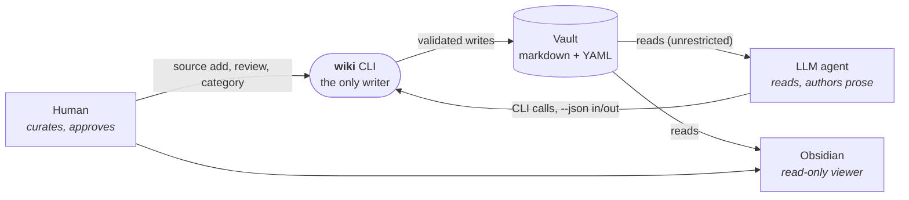
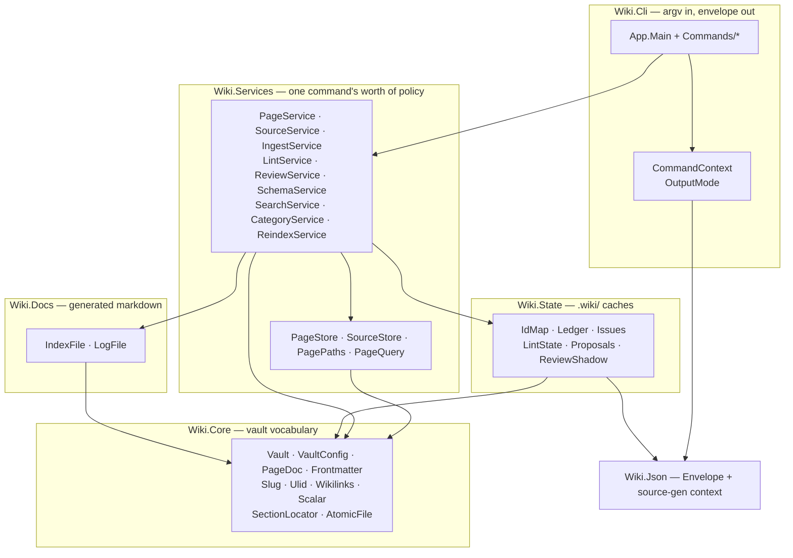

# Architecture

How the pieces fit and why they're arranged this way. For behaviour see
[functional flow](functional-flow.md); for what happens inside a single
invocation see [technical flow](technical-flow.md). The authoritative
requirements live in [spec.md](spec.md).

---

## The shape of the system

There is no daemon, no database and no server. `wiki` is a short-lived process
that opens a directory, validates something, writes some files, prints one line
of output and exits.



Two rules follow from that picture and explain most of the design:

1. **The filesystem is the source of truth.** Markdown files hold everything
   that matters. `.wiki/` is a cache, not a database — `wiki reindex` rebuilds
   it from frontmatter alone.
2. **Reading is unrestricted; only writing is mediated.** The agent may read
   any file directly. It may not write one. That asymmetry is the entire
   safety model, and it is enforced structurally: no command accepts a write
   path from the user. Every target is derived internally from a page's type
   and slug, a source's ID, or a fixed well-known path. There is no input that
   could name a protected file.

## Vault layout

A vault is a directory rooted at a `wiki.yaml`. It is simultaneously a valid
Obsidian vault.

```
my-vault/
├── wiki.yaml            # config: name, review gate, categories, lint thresholds (human-owned)
├── AGENTS.md            # agent instructions: conventions + playbooks (§13)
├── raw/                 # immutable sources, filenames are ULIDs
│   └── assets/          # Obsidian attachments — not scanned as sources
├── wiki/
│   ├── index.md         # routing catalog (CLI-generated)
│   ├── log.md           # append-only operation log (CLI-generated)
│   ├── overview.md      # singleton top-level synthesis
│   ├── summaries/       # one page per source
│   ├── entities/        # people, orgs, products, places
│   └── concepts/        # cross-source themes
└── .wiki/               # derived cache — always rebuildable
    ├── idmap.json       # id → vault-relative path
    ├── ledger.json      # ingest state machine, per source
    ├── issues.json      # lint findings with lifecycle
    ├── lint.json        # last-lint timestamp
    ├── proposals.json   # open AGENTS.md amendment proposals
    └── review/          # shadow copies for the review gate
```

Vault resolution follows `--vault` → `WIKI_VAULT` → walk up from the working
directory. All three branches require a `wiki.yaml` at the resolved root; an
explicit path that isn't a vault is an error, never an empty vault. (`wiki
init` is exempt — it is the command that creates the `wiki.yaml`.)

One binary serves many vaults. Everything that differs between contexts —
categories, review gate, lint thresholds — is data in `wiki.yaml`, not code.

## Code layers



| Namespace | Owns |
|---|---|
| `Wiki.Cli` | The `System.CommandLine` tree, one `Commands/*.cs` per command group, and the two output paths (`CommandContext.EmitOk`, `OutputMode.EmitFailure`) |
| `Wiki.Services` | One class per command group: preconditions, orchestration, and the order of validation-then-write. This is where the spec's rules live |
| `Wiki.Core` | The vault's vocabulary — path model, config, frontmatter parse/serialize, slugs, ULIDs, wikilinks, atomic writes |
| `Wiki.State` | The `.wiki/` JSON caches. Each store is a `Load` / mutate / `Save` object with deterministic, sorted serialization |
| `Wiki.Docs` | The two CLI-generated markdown files, `index.md` (fully regenerated) and `log.md` (appended) |
| `Wiki.Json` | The envelope type and the source-generated `JsonSerializerContext` every DTO is registered in |
| `Wiki.Templates` | Embedded `wiki.yaml` and `AGENTS.md` scaffolds for `wiki init` |

Dependencies point downward only. Services never talk to each other; a command
that needs two services' worth of work calls both.

### Store vs. service

`PageStore` / `SourceStore` are dumb read-only enumerators — "give me every
page in the vault, parsed". They sort ordinally so enumeration is deterministic
across filesystems, which is what makes `reindex` reproducible. `PageQuery`
holds the read-only query commands (`list`, `show`, `backlinks`); `PageService`
holds the mutations (`upsert`, `rename`, `set-status`). The split keeps the
mutation file focused on the part where ordering matters.

## The two output contracts

Every command emits exactly one envelope, and the shape is stable:

```json
{"v":1,"ok":true,"data":{"id":"01M05GY…","slug":"contoso","status":"active"},"errors":[]}
{"v":1,"ok":false,"data":null,"errors":[{"code":"dangling-link","message":"…","path":"…"}]}
```

Without `--json` the same result renders through Spectre.Console — a green `OK`
line on success, a red `ERROR <code> <message>` on failure. **Presentation is
the only difference.** The error codes and the exit codes are identical in both
modes, so a human and an agent are never debugging different systems.

| Exit | Meaning |
|---|---|
| `0` | Success |
| `1` | Blocking validation failure — input rejected, nothing written |
| `2` | Environment or IO error |
| `3` | State conflict — the world is already how you asked; idempotent no-op |

`ValidationException` and `StateConflictException` carry the code and map to
exit 1 and 3 respectively; anything else is exit 2. The mapping happens in one
place, `App.Main`.

## Design principles worth knowing before you change anything

**Validation runs to completion before the first byte is written.** Every
mutating service method is split by a literal `--- Validation complete ---`
comment. Everything above it is checks; everything below is writes. A rejected
call leaves the vault byte-identical to how it found it.

**Forward repair, not rollback.** Multi-file operations are not atomic and
there is no undo. Instead: every mutation is idempotent, the ledger records
what completed, `wiki ingest resume` finishes interrupted work, and `wiki lint`
detects residual inconsistency. `AtomicFile.Write` gives per-file crash safety
(write to a temp name in the same directory, then rename) and explicitly *not*
cross-file atomicity.

**Closed vocabularies.** Page types, statuses, ledger states, issue kinds and
frontmatter keys are fixed enumerations parsed by hand. Only category names and
page content are free text. This is what lets the frontmatter parser reject
unknown keys instead of shrugging at them.

**Determinism everywhere state is serialized.** Stores rebuild a sorted
snapshot immediately before writing, so `idmap.json` is byte-identical
regardless of insertion or filesystem enumeration order — a property `reindex`
is tested against.

**Clock and randomness are injected.** `PageService` takes `nowUnixMs` and
`randomBytes` functions, defaulting to the real clock and RNG. Tests pin them
for deterministic ULIDs and dates. Within one call the ULID timestamp and the
`created`/`updated` dates derive from the *same* captured instant, so they can
never disagree about "now".

**Nothing touches `System.Console`.** `App.Main` takes a `TextWriter` and
`TextReader` and threads them through `CommandContext`, so the whole command
tree runs in-process under parallel tests. Spectre gets a local console
instance writing to that writer, never the process-global one.

## Native AOT shapes the dependency list

The binary is `PublishAot=true`, single-file, self-contained, with
`InvariantGlobalization`. That means no reflection at runtime, which explains
several choices that would otherwise look like NIH:

| Concern | Choice | Why |
|---|---|---|
| Command parsing | `System.CommandLine` | AOT-friendly; Spectre.Console.Cli's reflection-based binding is not |
| Rendering | `Spectre.Console` (output only) | Used purely for human-facing output |
| YAML | Hand-rolled line parser | `wiki.yaml` and frontmatter are small closed schemas; YamlDotNet's reflection defaults are an AOT hazard |
| JSON | `System.Text.Json` with a source-generated context | Every DTO is registered in `WikiJsonContext` — an unregistered type fails at runtime, not compile time |
| Markdown | Regex over raw text | Wikilinks are simple enough (`\[\[([^\]|]+)(\|[^\]]+)?\]\]`, skipping code fences) that an AST is not worth it |
| ULIDs | ~30 lines of Crockford base32 | Cheaper than a dependency |

CI builds this matrix on every green `main`: `linux-x64`, `linux-arm64`,
`win-x64`, `osx-arm64`. Native AOT cannot cross-compile across operating
systems, so each target builds on its own runner. `osx-x64` still works if you
build it yourself — it is omitted from CI only because GitHub's Intel-Mac
runners are too scarce to gate a release on.

That one build feeds three distribution channels, all gated on the same green
run: the rolling `latest` prerelease of the raw binaries (what
`scripts/install.sh` and `scripts/install.ps1` fetch), a multi-arch GHCR image
that copies those same binaries onto an `ubuntu:24.04` base, and a `dotnet
tool` package on the GitHub Packages NuGet feed. The NuGet one is the
exception that proves the rule: `dotnet tool` has no native-AOT story, so that
channel alone ships the IL build and needs a runtime installed. It is offered
for .NET-toolchain users, not recommended as the default install.

## What is deliberately not here

No MCP server (the agent shells out). No embedded database, vector index or
full-text engine — routing through `index.md` plus `wiki search` is the
retrieval story. No git integration, no transactional rollback, no sync, no
multi-user concurrency, no web UI, no telemetry. See spec §2 and §17 for the
full non-goals list and the v2 candidates.
