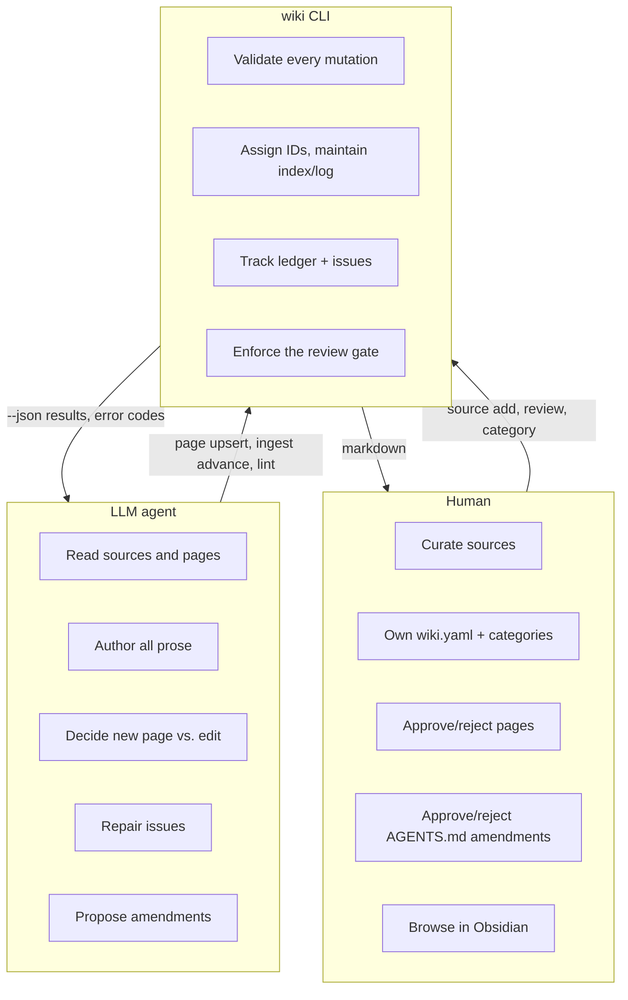
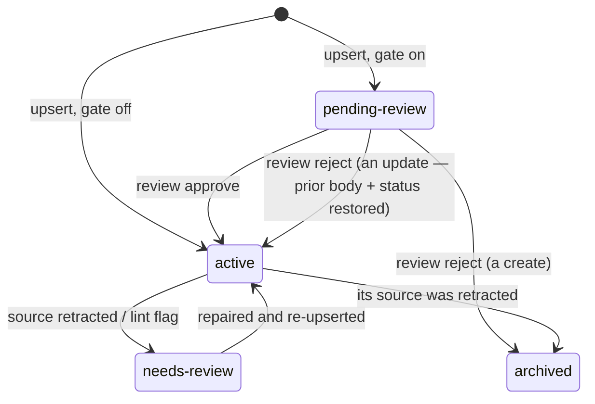
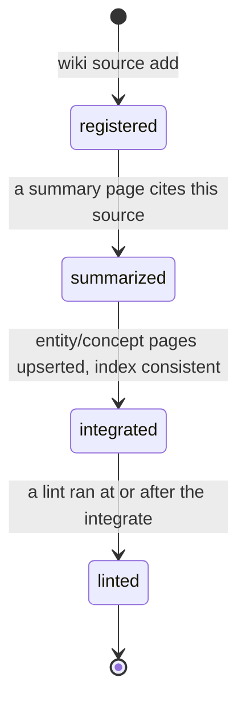
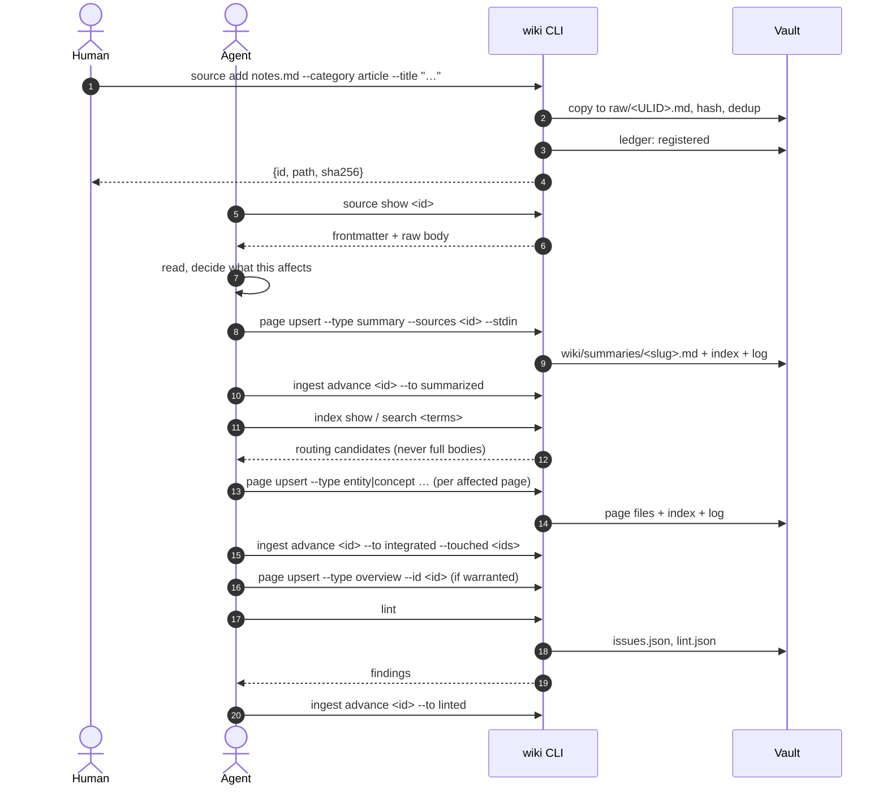
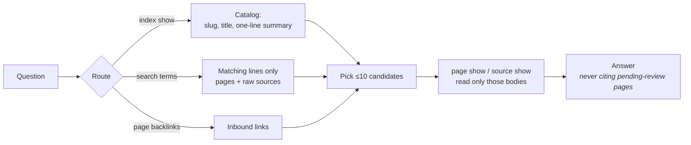
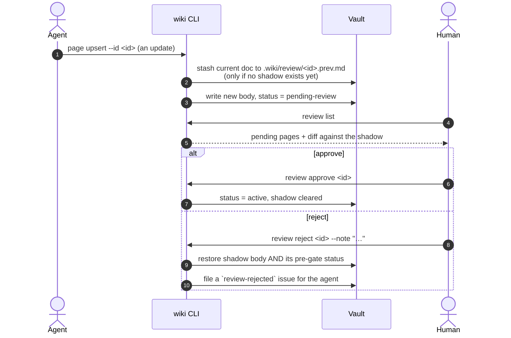
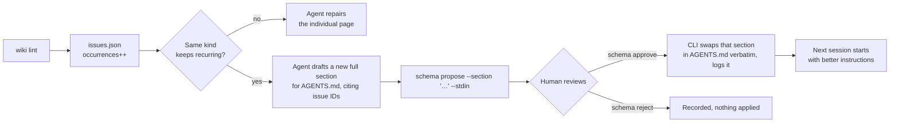
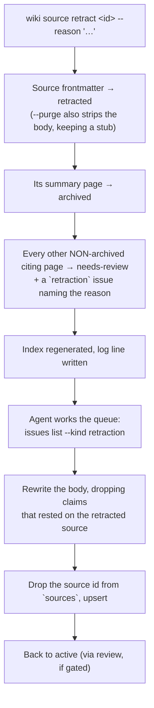

# Functional flow

What the system *does*, in terms of the people and processes involved: how a
raw file becomes wiki pages, how those pages get approved, what happens when a
source turns out to be wrong, and how the agent's own instructions improve over
time.

For code structure see [architecture](architecture.md); for what happens inside
one command see [technical flow](technical-flow.md).

---

## Who does what



The division is not arbitrary. The agent does the work that requires judgement
and produces prose. The CLI does the work that requires never forgetting. The
human owns anything that changes the rules.

## The page types

Five types, a closed set. Lint rules, the ingest workflow and the
new-page-vs-edit heuristic are all defined in terms of them.

| Type | Lives in | Is |
|---|---|---|
| `source` | `raw/` | Immutable raw material plus registration metadata |
| `summary` | `wiki/summaries/` | One per source: takeaways, claims, references |
| `entity` | `wiki/entities/` | A distinct nameable thing — person, org, product, place |
| `concept` | `wiki/concepts/` | A theme synthesized across sources; carries the evolving thesis |
| `overview` | `wiki/overview.md` | Singleton top-level synthesis |

The heuristic the agent applies: **new page** when it is a distinct
entity/concept you would link to from elsewhere; **edit in place** when it is
an attribute or update of something that already exists.

Each page's `status` drives how the rest of the system treats it:



`archived` pages are excluded from the index and from lint entirely.
`pending-review` pages *are* indexed — so the agent can route to and revise
them — but `AGENTS.md` forbids citing them in answers.

## Ingest: source in, wiki out

Ingest is a state machine per source, recorded in `.wiki/ledger.json`. Each
transition has a precondition the CLI checks before recording it, so the ledger
cannot claim work that didn't happen.



| State | Means | Precondition checked on advance |
|---|---|---|
| `registered` | File copied into `raw/`, hashed, frontmatter valid | entry state |
| `summarized` | Summary page exists | a `summary` page lists this source in `sources` |
| `integrated` | Affected entity/concept pages updated | `--touched id1,id2,…` supplied (may be empty), index verified consistent |
| `linted` | Health checked | `.wiki/lint.json`'s timestamp is at or after the `integrated` timestamp |

The full round trip:



**The resume guarantee.** A fresh session with no conversation context runs
`wiki ingest status`, sees `01M05… : summarized`, runs `wiki ingest resume
01M05…`, and gets back exactly what remains:

```json
{"sourceId":"01M05GXZ…","current":"integrated","remainingStates":["linted"],
 "expectedArtifacts":["a 'wiki lint' run recorded in .wiki/lint.json newer than this source's 'integrated' timestamp"]}
```

This — not format validation — is the primary defence against an agent losing
the thread mid-task.

## Retrieval: routing, not scanning

The agent is forbidden from scanning page bodies to discover what's relevant.
That's the difference between a knowledge base that stays cheap to query and
one that gets more expensive with every page added.



`index.md` is what makes this work: every page carries a required one-line
`summary` supplied at upsert time, and the index is regenerated from those on
every page mutation. An entry that doesn't route is useless, which is why
`--summary` is a blocking requirement rather than a nicety.

`wiki search` covers raw sources as well as pages, returns matching *lines*
rather than bodies, and reports `truncated` when `--limit` cut the scan short —
so a partial result is never mistaken for an exhaustive one.

## The review gate

Set `review_gate: true` in `wiki.yaml` and every page write lands as
`pending-review` until a human says otherwise.



Two details matter and both were bugs once:

- The shadow is written **only when none exists**. A run of consecutive
  un-reviewed edits therefore keeps pointing at the last body a human actually
  signed off on — otherwise rejecting would restore an intermediate revision
  nobody approved, which is precisely what the gate exists to prevent.
  Approve/reject clear the shadow, re-arming the capture.
- Reject restores the page's **pre-gate status**, not an unconditional
  `active`. Rejecting an edit to a `needs-review` page must not silently clear
  its flag.

Rejecting a *create* has no shadow to restore, so the page is archived instead.
Either way an issue is filed, so the rejection reaches the agent as work rather
than as a message it might not read.

## Health: lint, issues, and the reflect loop

`wiki lint` never edits page content. It observes, and files what it finds as
issues merged on `(kind, subject)` — so a problem that survives several lint
runs accumulates `occurrences` on one record instead of spawning a new row each
time.

| Kind | Flags |
|---|---|
| `orphan` | Active page with zero inbound wikilinks |
| `dangling-link` | Wikilink target missing |
| `stale` | Summary older than `staleness_days` with newer sources on the same subjects |
| `coverage-gap` | A term mentioned across ≥3 pages with no page of its own |
| `index-drift` | Index entries ≠ actual pages (auto-fixed, but filed so the cause gets found) |
| `oversize` | Page over `max_page_lines` — a split candidate |
| `rename-drift` | Idmap path mismatch, i.e. someone renamed a file in Obsidian |
| `needs-review-backlog` / `pending-backlog` | Pages sitting in a review state over 14 days |
| `review-rejected` | A human rejected a pending page; the agent must revise |
| `retraction` | A cited source was retracted; the page needs repair |

Only `--fix-links` repairs anything, and only mechanical link targets after a
detected rename. Everything else is a tracked repair job.

The occurrence count is the point:



A recurring finding is evidence that the *instructions* are deficient, not that
the agent made a one-off mistake. `AGENTS.md` is the system's only learning
surface — the operational memory that compounds — and amendments to it are
full-section replacements, never diffs: deterministic to apply, no patch engine
to go wrong. The agent may propose. Only the human applies.

## Retraction: when a source turns out to be wrong



The raw file is not deleted by default — the archived summary is what the agent
reads to work out which claims rested on it. Already-archived citing pages are
left alone: flipping them back to `needs-review` would resurrect dead history
into active scope. Retracting an already-retracted source is a state conflict
(exit 3), not an error.

Deletion is thus a tracked repair job with a work queue, rather than
archaeology.

## Category and config changes

Categories are per-vault and entirely user-defined; the CLI never invents one.
An unknown category on `source add` is a blocking error telling the human to
add it first. Removing a category that registered sources still reference is a
blocking config error raised on *every* config-reading command — with one
carve-out: `wiki category …` itself is exempt, because `wiki category add
<missing-id>` is the intended repair, and a check that blocks its own fix is a
trap.
