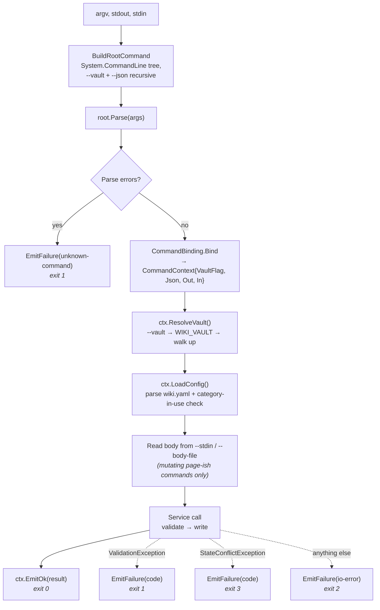
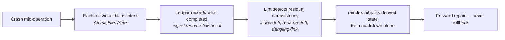
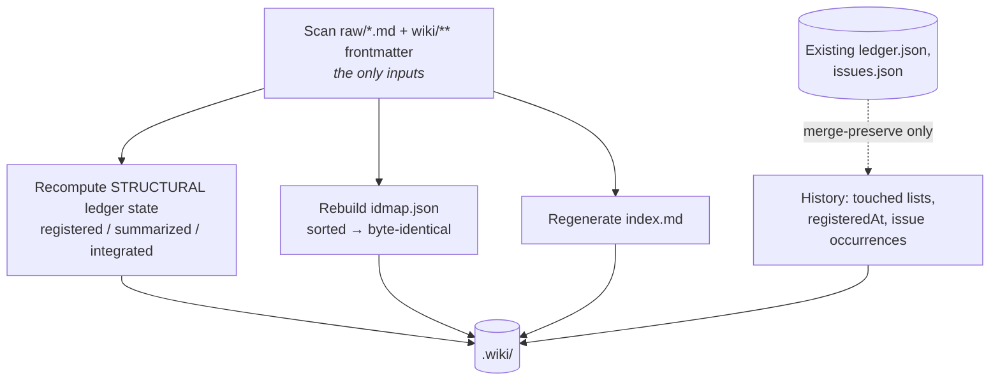

# Technical flow

One `wiki` invocation, end to end: from `argv` to the bytes on disk. Read
[architecture](architecture.md) first for the layer map.

---

## The invocation pipeline

Every command follows the same path. There are no exceptions and no
alternative entrypoints — `App.Main` is the only door.



A few things are load-bearing here:

**`App.Main` takes its streams as parameters.** `Main(args)` delegates to
`Main(args, Console.Out, Console.In)`; tests call the three-argument overload
with a `StringWriter`. Nothing below it ever references `System.Console`, which
is why the whole command tree runs in-process under parallel test execution.

**Parse errors are intercepted before invocation.** `System.CommandLine`'s
default handling prints usage text and returns 1 — it never produces the
envelope. Unknown commands and missing arguments are caught explicitly so
garbage input still yields `{"ok":false,"errors":[{"code":"unknown-command",…}]}`.
On that path `--json` can't be read off the parse result, so `argv` is scanned
directly: a user who typed `--json` gets JSON back even when the rest of what
they typed was nonsense.

**`EnableDefaultExceptionHandler = false`.** Exceptions propagate out of the
command action so the three `catch` clauses in `App.Main` own the
exception → envelope → exit-code mapping. One place, not per-command.

**Config loading carries a cross-check.** `ctx.LoadConfig()` parses `wiki.yaml`
*and* verifies every category still referenced by a registered source exists —
so a config that lost a category fails every command that reads it.
`wiki category` uses `LoadConfigWithoutCategoryCrossCheck()` instead, because
`category add <missing-id>` is the documented repair.

## Walkthrough: `wiki page upsert`

The most involved command, and the template every other mutation follows.

```mermaid
sequenceDiagram
    autonumber
    participant M as App.Main
    participant PC as PageCommand
    participant PS as PageService
    participant St as PageStore
    participant IM as IdMap
    participant AF as AtomicFile
    participant IX as IndexFile / LogFile
    participant Is as Issues

    M->>PC: parsed options + CommandContext
    PC->>PC: read body (stdin or --body-file)
    PC->>PC: ResolveVault() + LoadConfig()
    PC->>PS: Upsert(vault, cfg, UpsertRequest)

    rect rgba(180,40,40,0.10)
        note over PS: Validation — nothing has touched disk yet
        PS->>PS: --summary present? scalars single-line + quotable?
        PS->>St: Enumerate() — every page, parsed
        PS->>PS: overview singleton? duplicate title? slug collision?
        PS->>IM: Load(); every --sources id resolves under raw/?
        PS->>PS: Wikilinks.Extract(body) → dangling targets
        PS->>PS: build frontmatter, Serialize(), then Parse() it back
    end

    rect rgba(40,140,60,0.10)
        note over PS: --- Validation complete --- writes begin
        PS->>AF: Write(page file) — temp + rename
        PS->>IM: Put(id, relPath); Save()
        PS->>St: Enumerate() fresh
        PS->>IX: IndexFile.Regenerate(v, pages)
        PS->>IX: LogFile.Append(ts, "upsert", slug, detail)
        PS->>Is: file dangling-link issues (only if --allow-dangling)
    end

    PS-->>PC: UpsertResult{id, slug, path, status, danglingFiled}
    PC->>M: ctx.EmitOk(result) → exit 0
```

### Validation order, and why it's an order

Every check runs before the first write. That's what makes a rejected upsert
leave the vault byte-identical to how it found it — and it's why the reads
interleaved with the checks (`PageStore.Enumerate`, `IdMap.Load`) are safe
mid-validation: they're reads.

| Check | Error code |
|---|---|
| `--summary` present | `summary-required` |
| Title/summary are single-line and quotable | `frontmatter-schema` |
| Overview is a singleton (create path) | `overview-exists` |
| No existing page of this type with the same title (case-insensitive) | `duplicate-title` |
| Every `--sources` id resolves to a path under `raw/` | `unknown-source` |
| Every `[[wikilink]]` target exists, unless `--allow-dangling` | `dangling-link` |
| The serialized document round-trips through the closed-schema parser | `frontmatter-schema` |

The last one is the real frontmatter gate: the document is serialized and then
parsed back with the *same* parser that reads page files off disk. If it
wouldn't survive a read, it doesn't get written.

The update path adds two immutability checks — `type-mismatch` and
`title-mismatch`. A page's type is fixed at creation, and its title drives its
slug and identity; changing a title is `wiki page rename`, which also rewrites
inbound links. Both flags are required on every upsert, so silently discarding
a differing value would look like the flag did something. Rejecting is the
safer half of that trade.

### What one page write actually costs

Six file operations, in this order: the page file, `idmap.json`, `index.md`,
`log.md`, and (conditionally) `issues.json`. The index is *fully regenerated*
from a fresh enumeration rather than patched — cheap at vault scale, and it
means the index cannot drift from the pages by construction.

## Writes, crashes, and repair

`AtomicFile.Write` writes to `<path>.<guid>.tmp` in the same directory, then
renames over the target, deleting the temp file if anything throws. That buys
**per-file** crash safety and nothing more.

Cross-file atomicity is explicitly not provided. A crash between the page write
and the index regeneration leaves an inconsistent vault, and that is an
accepted, designed-for outcome:



`wiki page rename` is the clearest example: the move is `AtomicFile.Write(new)`
then `File.Delete(old)`, two operations. A crash between them leaves both files
on disk momentarily; `reindex` heals it by rebuilding from whatever page files
exist.

The `raw/`-is-immutable and `index.md`/`log.md`-are-CLI-only rules are enforced
**structurally, not by a runtime guard**: no command accepts a write path from
the user. Targets are always derived from a page's type and slug, a source's
ID, or a fixed well-known path. A guard function for this used to exist with no
production callers; it was deleted rather than left in place, because dead
safety code invites the assumption that something is being checked.

## `wiki reindex`: rebuilding the cache

The recovery command, and the property the whole "filesystem is truth" claim
rests on.



Nothing here reads the existing `idmap.json` or `index.md`. `ledger.json` is
read *only* to merge-preserve history, never to seed the recomputed state.

The distinction that makes this honest: **structural** state is derivable from
markdown and is rebuilt exactly — the idmap byte-for-byte, and the ledger state
each source is in. **Historical** state is not in the markdown at all — issue
`first_seen`/`occurrences`/`last_seen`, the ledger's `--touched` audit list, the
last-lint timestamp, review shadows. Those are merge-preserved best-effort, and
reindex makes no byte-identity claim about them. The tests encode exactly that
split.

## State stores

Each `.wiki/*.json` file has a store class in `Wiki.State` with the same
`Load` → mutate → `Save` shape.

| Store | File | Notes |
|---|---|---|
| `IdMap` | `idmap.json` | `id → vault-relative path`, forward slashes even on Windows. Sorted on save so reindex is reproducible |
| `Ledger` | `ledger.json` | Per-source ingest state + history. Sorted by source id on save |
| `Issues` | `issues.json` | Merged on `(kind, subject)` |
| `LintState` | `lint.json` | One timestamp — the `linted` precondition compares against it |
| `Proposals` | `proposals.json` | AGENTS.md amendments; records state and text, never touches AGENTS.md itself |
| `ReviewShadow` | `review/<id>.prev.md` | Not JSON — the full previous document, serialized exactly as a page file |

Two merge rules are worth knowing because they're load-bearing for the reflect
loop:

**`Issues.Upsert` merges only into an *open* issue.** A finding whose prior
issue was already `resolved` files a new one rather than reopening it.
Reopening would erase the resolution note, and "open since forever" and
"recurred after being fixed" are genuinely different situations for the agent
to act on.

**Both filing paths use the same key and detail string.** `--allow-dangling`
files its `dangling-link` issues at write time, from the upsert itself, using
the identical `(kind, subject)` key and detail text `LintService` uses. A link
that stays dangling accumulates occurrences on *one* record across both paths
instead of forking into two half-counted issues.

## Ledger preconditions

`wiki ingest advance` refuses to record a transition whose artifacts don't
exist. The interesting one is `linted`: it accepts `lastLint >= integratedAt`,
not a strict `>`. Timestamps are second-granularity and the canonical flow is
integrate-then-lint back to back, so a strict comparison would reject a lint
that genuinely ran after the integrate whenever both landed in the same
wall-clock second — and would keep rejecting for up to a second with no
explanation. The worst case under the relaxed rule (a lint fractionally before
the integrate in the same second) is negligible and self-corrects on the next
lint.

Re-advancing to the state a source is already in is a `StateConflictException`
— exit 3, an idempotent no-op — not an error. Same for retracting an
already-retracted source. The agent is told "the world is already how you
asked" and moves on.

## Serialization contract

JSON goes through `System.Text.Json` with a source-generated context
(`WikiJsonContext`), camelCase, nulls omitted — except `data`, which is
explicitly emitted as `null` on failures so all four envelope keys are always
present.

**Every DTO must be registered in `WikiJsonContext`.** Native AOT has no
reflection fallback, so an unregistered type fails at runtime rather than at
compile time. Adding a command means adding its result record to that context.

Frontmatter is written by hand in a fixed key order with fixed quoting, and
`PageDoc.Parse` / `Serialize` are exact inverses for well-formed input — the
body is preserved verbatim. `Scalar.GuardSingleLineQuotable` rejects values
containing `"` or newlines before they reach a single-line quoted slot, because
neither writer escapes anything.

## Adding a command

1. Add a `Commands/XCommand.cs` with a `Build(vaultOption, jsonOption, stdout,
   stdin)` returning a `Command`, wiring handlers through
   `CommandBinding.Bind`.
2. Register it with one `root.Add(...)` line in `App.BuildRootCommand`.
3. Put the policy in a `Wiki.Services` class — validation first, a
   `--- Validation complete ---` line, then writes.
4. Make the result record implement `IHumanRenderable` and register it in
   `WikiJsonContext`.
5. Test it through `TempVault.Run(...)`, which drives the real `App.Main`
   in-process.
